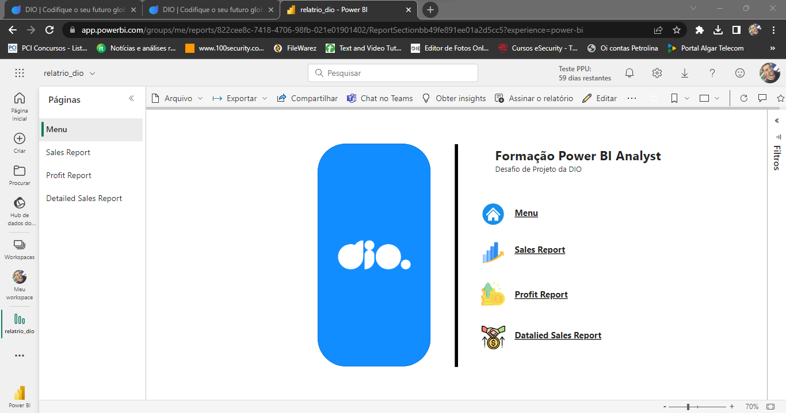

## Dio - Formação Power BI Analyst

### Instruções de Entrega do Desafio

#### Descrição do desafio: 

Você irá criar um relatório mais elaborado com base na sample financials do Power BI. Os arquivos de dados estão disponíveis no github: 

https://github.com/julianazanelatto/power_bi_analyst

Desafio | Conclusão
---------|----------
Criar a segunda página do relatório | ✅
Publique o seu relatório no Power BI Service | ✅
Caso você tenha familiaridade fique livre para utilizar outros artifícios nos botões e outros | ✅
Submenta seu projeto através do link no github | ✅

- Menu

- Sales Report

- Profit Report

- Detailed Sales Report
